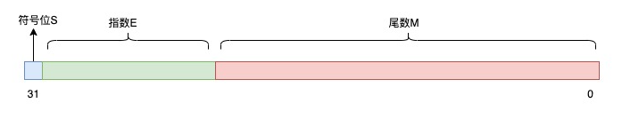
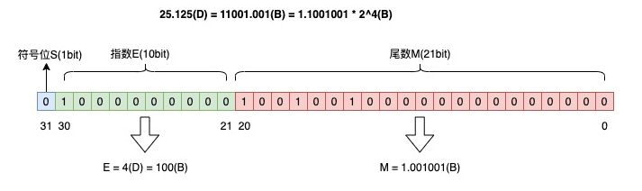
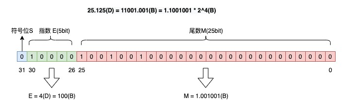
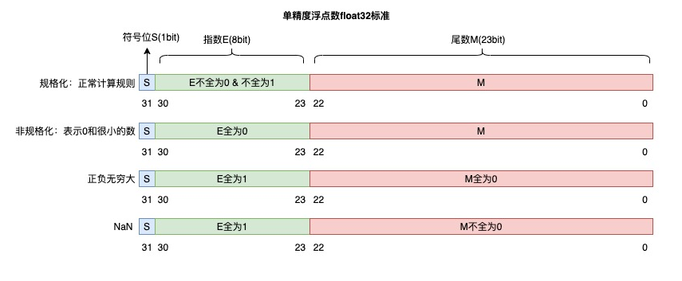
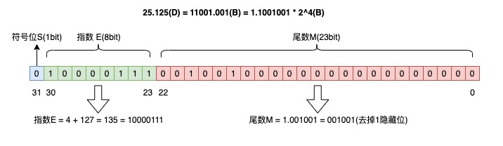

# 1.7信息在计算机中的表示

**1、R进制下某等式，求该进制下另一算式的结果**

1. 利用权值将等式两边转化为十进制，求出R.
2. 再将另一算式的十进制结果转化为R进制.


**2、1位八进制数用3位二进制数表示,1位十六进制数用4位二进制数表示**

**3、0在原码和反码中有2种表示，在补码中只有一种表示**

|      | +0       | -0       |
| ---- | -------- | -------- |
| 原码 | 00000000 | 10000000 |
| 反码 | 00000000 | 11111111 |
| 补码 | 00000000 | 00000000 |

**4、正数的原码等于反码等于补码**

**5、n位二进制无符号整数表示范围：0-2<sup>n</sup>-1**

**6、十进制有限小数<font color=red>不一定</font>可以转化为二进制有限小数**

**7、R进制转十进制：整数与小数部分分别按权值相加**

**十进制转R进制: 整数部分除R逆序取余，小数部分乘R顺序取整。**

**R<sub>1</sub>进制与R<sub>2</sub>进制互转：通过二进制过渡。**

**8、求出选项中不同进制下最小的数**:

1. 两两相比
2. 全都转换成十进制

**9、二进制与八进制互转**

八进制转二进制：每一位八进制数转换为三位等值二进制数，且保持高低顺序不变。

二进制转八进制：整数部分：从低位到高位每<font color=red>3</font>位二进制数转换为等值八进制数，不足三位在高位补0.

​					小数部分：从高位到低位每<font color=red>3</font>位二进制数转换为等值八进制数，不足三位在低位补0.


二进制与十六进制同理，一位十六进制数用<font color=red>4</font>位二进制数表示。

R进制用<font color=red>log<sub>2</sub>R</font>位二进制数表示。

**10、给出十进制数求其补码:**

正数：化为二进制。符号位为0，一般要凑足8位。正数的原码等于反码等于补码。

负数：化为二进制。符号位为0，一般要凑足8位。得出补码，符号位不变，其余各位取反后加1得到补码。

**11、给出补码，求十进制数**

1. 补码的补码就是其原码。
2. 求得原码后再转化为十进制数。

**12、给出若干个0、1 ，求其组成的补码表示的最大数、最小数**

口诀：<font color=red>补码补码，要大排大，要小排小</font>

1. 求最大数
   1. 无符号最大数：先排1，再排0.直接转换为十进制数。
   2. 有符号最大负数：符号位排1，后续先排1，再排0，得到补码，求出其原码后转换为十进制。
   3. 有符号最大正数：符号位排0，后续先排1，再排0，得到补码，正数三码一样，直接转换为十进制。
2. 求最小数
   1. 无符号最小数：先排0，后排1，直接转化为十进制。
   2. 有符号最小负数：符号位排1，后续先排0，再排1，得到补码，求出其原码后转化为十进制。
   3. 有符号最小正数：符号位排0，后续先排0，再排1，得到补码，正数三码一样，直接转换为十进制。

**13、n位二进制补码表示的范围：[-2<sup>n-1</sup>, 2<sup>n-1</sup>-1]**

**14、补码加减法规则**

[X]<sub>补</sub>±[Y]<sub>补</sub>=[X±Y]<sub>补</sub>

[X]<sub>补</sub>求[-X]<sub>补</sub>：以[X]<sub>补</sub>包含符号位取反后+1

**15、原码与补码的特点**

1. 正数的原码等于补码。

2. 位数相同的情况下，补码表示的范围比原码表示的范围多一个

   如8位二进制补码表示的范围为[-2<sup>7</sup>， 2<sup>7</sup>-1]，其中10000000表示-128，而不是-0.

3. 补码的补码就是原码。

4. 二进制原码的表示范围中，正数部分的最大值和负数部分的最小值的绝对值相等。

5. 二进制补码表示的范围中，补码负数部分的小最小值的绝对值比正数部分的最大值大1。

**16、定点数**

1. 定点整数：小数点固定在有效数值部分最低位之后的定点数，等于就是纯整数。

   数值范围：[-(2<sup>n-1</sup>-1)，2<sup>n-1</sup>-1]

2. 定点小数：小数点位置固定在符号位之后，有效数最高位之前的定点数，是纯小数。

   数值范围：[-(1-2<sup>-(n-1)</sup>)，1-2<sup>-(n-1)</sup>]

**17、浮点数**

1. 特点：既有整数部分又有小数部分，小数点位置不固定。
2. 整数和纯小数是实数的特例。
3. 任何一个实数总是可以表达成一个乘幂和一个纯小数之积。

浮点数是采用科学计数法的方式来表示的，例如十进制小数 8.345，用科学计数法表示，可以有多种方式：

```tex
8.345 = 8.345 * 10^0
8.345 = 83.45 * 10^-1
8.345 = 834.5 * 10^-2
...
```

用科学计数法的方式表示小数时，小数点的位置就变得漂浮不定了，这就是相对于定点数，浮点数名字的由来。

使用同样的规则，对于二进制数，我们也可以用科学计数法表示，也就是说把基数 10 换成 2 即可。


浮点数是采用科学计数法来表示一个数字的，它的格式可以写成这样：

```tex
V = (-1)^S * M * R^E
```

- S：符号位，取值 0 或 1，决定一个数字的符号，0 表示正，1 表示负
- M：尾数，用小数表示，例如前面所看到的 8.345 * 10^0，8.345 就是尾数
- R：基数，表示十进制数 R 就是 10，表示二进制数 R 就是 2
- E：指数，用整数表示，例如前面看到的 10^-1，-1 即是指数
- R<sup>E</sup>表示阶码。改变阶码能使小数点的位置产生移动。

如果我们要在计算机中，用浮点数表示一个数字，只需要确认这几个变量即可。

假设现在我们用 32 bit 表示一个浮点数，把以上变量按照一定规则，填充到这些 bit 上就可以了：



假设我们定义如下规则来填充这些 bit：

- 符号位 S 占 1 bit
- 指数 E 占 10 bit
- 尾数 M 占 21 bit

按照这个规则，将十进制数 25.125 转换为浮点数，转换过程就是这样的（D代表十进制，B代表二进制）：

1. 整数部分：25(D) = 11001(B)
2. 小数部分：0.125(D) = 0.001(B)
3. 用二进制科学计数法表示：25.125(D) = 11001.001(B) = 1.1001001 * 2^4(B)

所以符号位 S = 0，尾数 M = 1.001001(B)，指数 E = 4(D) = 100(B)。

按照上面定义的规则，填充到 32 bit 上，就是这样：



但这里有个问题，我们刚才定义的规则，符号位 S 占 1 bit，指数位 E 占 10 bit，尾数 M 占 21 bit，这个规则是我们拍脑袋随便定义出来的。

如果你也想定一个新规则，例如符号位 S 占 1 bit，指数位 E 这次占 5 bit，尾数 M 占 25 bit，是否也可以？当然可以。

按这个规则来，那浮点数表示出来就是这样：



我们可以看到，指数和尾数分配的位数不同，会产生以下情况：

1. 指数位越多，尾数位则越少，其表示的范围越大，但精度就会变差，反之，指数位越少，尾数位则越多，表示的范围越小，但精度就会变好
2. 一个数字的浮点数格式，会因为定义的规则不同，得到的结果也不同，表示的范围和精度也有差异

早期人们提出浮点数定义时，就是这样的情况，当时有很多计算机厂商，例如IBM、微软等，每个计算机厂商会定义自己的浮点数规则，不同厂商对同一个数表示出的浮点数是不一样的。

这就会导致，一个程序在不同厂商下的计算机中做浮点数运算时，需要先转换成这个厂商规定的浮点数格式，才能再计算，这也必然加重了计算的成本。

那怎么解决这个问题呢？业界迫切需要一个统一的浮点数标准。

**浮点数标准**

直到1985年，IEEE 组织推出了浮点数标准，就是我们经常听到的 **IEEE754 浮点数标准**，这个标准统一了浮点数的表示形式，并提供了 2 种浮点格式：

- 单精度浮点数 float：32 位，符号位 S 占 1 bit，指数 E 占 8 bit，尾数 M 占 23 bit
- 双精度浮点数 double：64 位，符号位 S 占 1 bit，指数 E 占 11 bit，尾数 M 占 52 bit

为了使其表示的数字范围、精度最大化，浮点数标准还对指数和尾数进行了规定：

1. 尾数 M 的第一位总是 1（因为 1 <= M < 2），因此这个 1 可以省略不写，它是个**隐藏位**，这样单精度 23 位尾数可以表示了 24 位有效数字，双精度 52 位尾数可以表示 53 位有效数字
2. 指数 E 是个无符号整数，表示 float 时，一共占 8 bit，所以它的取值范围为 0 ~ 255。但因为指数可以是负的，所以规定在存入 E 时在它原本的值加上一个**中间数** 127，这样 E 的取值范围为 -127 ~ 128。表示 double 时，一共占 11 bit，存入 E 时加上中间数 1023，这样取值范围为 -1023 ~ 1024。

除了规定尾数和指数位，还做了以下规定：

- 指数 E 非全 0 且非全 1：规格化数字，按上面的规则正常计算
- 指数 E 全 0，尾数非 0：非规格化数，尾数隐藏位不再是 1，而是 0(M = 0.xxxxx)，这样可以表示 0 和很小的数
- 指数 E 全 1，尾数全 0：正无穷大/负无穷大（正负取决于 S 符号位）
- 指数 E 全 1，尾数非 0：NaN(Not a Number)



有了这个统一的浮点数标准，我们再把 25.125 转换为标准的 float 浮点数：

1. 整数部分：25(D) = 11001(B)
2. 小数部分：0.125(D) = 0.001(B)
3. 用二进制科学计数法表示：25.125(D) = 11001.001(B) = 1.1001001 * 2^4(B)

所以 S = 0，尾数 M = 1.001001 = 001001(去掉1，隐藏位)，指数 E = 4 + 127(中间数) = 135(D) = 10000111(B)。填充到 32 bit 中，如下：



这就是标准 32 位浮点数的结果。

如果用 double 表示，和这个规则类似，指数位 E 用 11 bit 填充，尾数位 M 用 52 bit 填充即可。


**浮点数为什么有精度损失？**

我们再来看一下，平时经常听到的浮点数会有精度损失的情况是怎么回事？

如果我们现在想用浮点数表示 0.2，它的结果会是多少呢？

0.2 转换为二进制数的过程为，不断乘以 2，直到不存在小数为止，在这个计算过程中，得到的整数部分从上到下排列就是二进制的结果。

```tex
0.2 * 2 = 0.4 -> 0
0.4 * 2 = 0.8 -> 0
0.8 * 2 = 1.6 -> 1
0.6 * 2 = 1.2 -> 1
0.2 * 2 = 0.4 -> 0（发生循环）
...
```

所以 0.2(D) = 0.00110…(B)。

因为十进制的 0.2 无法精确转换成二进制小数，而计算机在表示一个数字时，宽度是有限的，无限循环的小数存储在计算机时，只能被截断，所以就会导致小数精度发生损失的情况。

**浮点数的范围和精度有多大？**

最后，我们再来看一下，用浮点数表示一个数字，其范围和精度能有多大？

以单精度浮点数 float 为例，它能表示的最大二进制数为 +1.1.11111…1 * 2^127（小数点后23个1），而二进制 1.11111…1 ≈ 2，所以 float 能表示的最大数为 2^128 = 3.4 * 10^38，即 float 的表示范围为：-3.4 * 10^38 ~ 3.4 * 10 ^38。

它能表示的精度有多小呢？

float 能表示的最小二进制数为 0.0000….1（小数点后22个0，1个1），用十进制数表示就是 1/2^23。

用同样的方法可以算出，double 能表示的最大二进制数为 +1.111…111（小数点后52个1） * 2^1023 ≈ 2^1024 = 1.79 * 10^308，所以 double 能表示范围为：-1.79 * 10^308 ~ +1.79 * 10^308。

double 的最小精度为：0.0000…1(51个0，1个1)，用十进制表示就是 1/2^52。

从这里可以看出，虽然浮点数的范围和精度也有限，但其范围和精度都已非常之大，所以在计算机中，对于小数的表示我们通常会使用浮点数来存储。

总结：

1. 浮点数一般用科学计数法表示
2. 把科学计数法中的变量，填充到固定 bit 中，即是浮点数的结果
3. 在浮点数提出的早期，各个计算机厂商各自制定自己的浮点数规则，导致不同厂商对于同一个数字的浮点数表示各不相同，在计算时还需要先进行转换才能进行计算
4. 后来 IEEE 组织提出了浮点数的标准，统一了浮点数的格式，并规定了单精度浮点数 float 和双精度浮点数 double，从此以后各个计算机厂商统一了浮点数的格式，一直延续至今
5. 浮点数在表示小数时，由于十进制小数在转换为二进制时，存在无法精确转换的情况，而在固定 bit 的计算机中存储时会被截断，所以浮点数表示小数可能存在精度损失
6. 浮点数在表示一个数字时，其范围和精度非常大，所以我们平时使用的小数，在计算机中通常用浮点数来存储

**18、定点小数在二进制中的表示**

b<sup>0</sup>b<sup>-1</sup>b<sup>-2</sup>b<sup>-3</sup>b<sup>-4</sup>b<sup>-5</sup>b<sup>-6</sup>b<sup>-7</sup>

其中b<sup>0</sup>是符号位，小数点就在其后。

[10000000]<sub>补</sub> = -0.0000000

不考虑符号位时 反码：-0.1111111

不考虑符号位时 补码（可以得到原码）：-1.0000000

### 19、移码

移码也称为增码或偏码，常用于表示浮点数中的阶码。移码可由补码求得，只要把补码的符号位取反就得到了移码。**在移码表示中，0的编码是相同的，[+0]移=1000000，[-0]移=1000000。**

所以，在<font color=red>补码、移码</font>表示中，0的表示只有一种。
