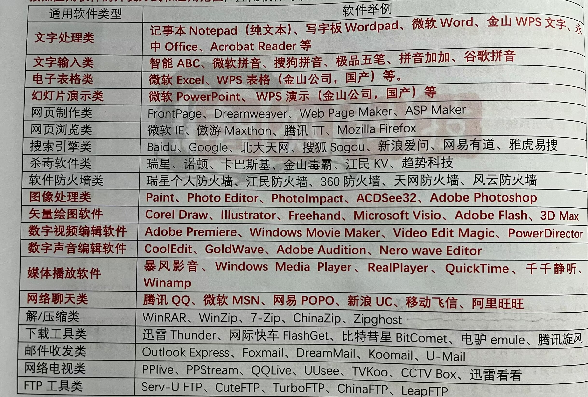

# 2.1软件的基本概念

## 1.软件是什么

软件=程序+数据+相关说明文档

其中说明文档必不可少。如：QQ不能成为软件，而是应用程序，因为用户并没有说明文档（相对于开发者而言）。但是软件和程序本质上是相同的。因此在不会发生混淆的情况下，软件和程序两个名称经常可以互换使用，并不加以严格区分。

- 程序：要计算机做什么或完成什么功能的一组指令。

​	程序具有以下特点:

		1. 完成某一确定的信息处理任务。
		2. 使用某种计算机语言描述如何完成该任务。
		3. 存储在计算机中，并在启动运行（被cpu执行）后才起作用。

- 数据：计算机执行程序过程中的输入和输出数据。
- 相关文档：程序开发、维护和操作有关的资料，不可缺少。

## 2.软件的知识产权

1. 软件是智力活动的成果，受到知识产权(版权)法的保护。

2. 版权授予**软件作者**(版权所有者)享有下列权利：
   		拷贝、发布、修改、署名、出售、···

3. 保护知识产权的目的：确保脑力劳动受到奖励并鼓励发明创造，保护知识产权就是保护脑力劳动人员，使他们发挥创造能力，社会也会从他们的成果中受益 。

4. 购买一个软件，用户仅仅得到了该软件的使用权，**并没有**获得它的版权

5. 随意进行软件拷贝和分发是一种**违法**行为。

## 3.计算机软件的特性

1. 不可见性。软件是原理、规则、算法的实现，是无形的，不能被人们直接观察、欣赏和评价。
2. 适用性：可以适应一类问题的需要。
3. 依附性：依附于特定的硬件、网络和其他软件。
4. 复杂性：规模越来越大，人力和物力消耗越来越高。
5. 无磨损性：功能和性能一般不会发生变化。
6. 易复制性：可以非常容易且无失真的进行复制。
7. 不断演变性：有生命周期。
8. 有限责任：具有有限保证。
9. 脆弱性格：容易遭受黑客、病毒、信息盗用等损害。

## 4.计算机软件的分类

1. 按功能和作用分：系统软件和应用软件

   1. 系统软件

      系统软件泛指为了安全有效的使用计算机系统、给应用软件开发与运行提供支持或为用户管理和使用计算机提供方便的软件。

      例如：

      1. 基本输入/输出系统(BIOS)
      2. 操作系统：Windows、Linux、macOS...
      3. 程序设计语言处理系统：C语言编译器...
      4. 数据库管理系统DBMS：MySQL、Oracle......
      5. 通信协议软件
      6. 常用的实用程序：磁盘清理程序、备份程序、杀毒软件...

      系统软件的主要特征是：他与计算机硬件密切相关，能对硬件资源进行统一的控制、调度和管理，具有基础性和支撑作用，是应用软件的运行平台。

   2. 应用软件

      应用软件泛指专门用于为用户解决各种具体应用、完成特定任务的软件。

      按照开发方式和适用范围，应用软件可以再分为通用软件和定制软件。

      1. 通用软件

         几乎人人都要用的软件。

         

      2. 定制软件

         按不同领域不同用户的需求而专门设计开发。如学校教务网。

2. 按软件权益的处置方式分：商品软件、共享软件、自由软件

   1. 商品软件

      需要付费才能得到使用权。通常按照软件许可证（license）的规定使用软件。

      软件许可证（license）：规定了软件的使用方式的法律合同，软件的使用有哪些额外的限制、额外的权利等。

      许可证的类型：单用户许可证、多用户许可证、并发用户许可证、定点许可证等。

      用户购买了一个软件后仅仅得到了软件的使用权，并没有他的版权。购买了多用户许可证后，可以将该软件安装在若干台计算机上或者允许若干用户使用。

      例如：Windows系统

   2. 共享软件

      也可以叫“试用软件”。它仍然具有版权，但是允许用户先免费试用一段时间，允许用户进行拷贝和散发（但不允许修改后散发）。过了试用期需要购买才能继续使用。

      例如：Typora、jetbrains全家桶

   3. 自由软件

      也叫“开源软件”。用户可在软件的开源许可证的规定下共享软件，允许随意拷贝、修改其源代码，允许自由传播，但对源代码的任何修改都必须公开，还必须允许其他用户享有进一步拷贝和修改的自由。

      例如：Linux内核、Apache的开源软件...

   4. 免费软件

      无需付费就可以使用的软件。但是用户没有修改和分发该软件的权利，其源代码也不一定公开。免费软件不一定是开源软件，也可能有付费才能使用的功能。

      例如：QQ、微信等。

