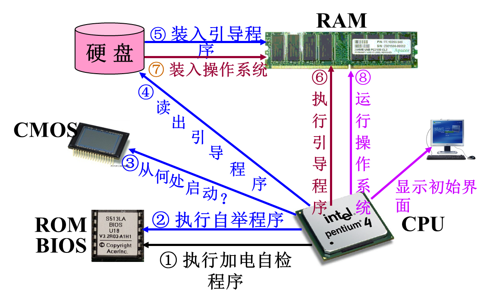

# 2.2操作系统

未安装操作系统的计算机（裸机）是无法使用的（裸机：未安装任何软件的计算机），操作系统是计算机中最重要的一种系统软件，由许多程序模块组成。他们能以有效、合理和安全的方式组织和管理计算机的软硬件资源，科学的为计算机安排工作流程，控制和支持应用程序的运行，并向用户提供用户界面（人机接口），使用户能容易、方便、有效、安全的使用计算机。

## 1.操作系统的作用

1. 为计算机中的应用程序的运行提供支持和服务。
2. 为计算机中运行中的应用程序管理和分配系统资源。
3. 为用户提供友善的人机接口（GUI界面）。
4. 为应用程序的开发提供高效率的平台。

## 2.操作系统的组成

操作系统内核+配套软件

1. 操作系统内核

   内核（kernel）是提供任务管理、存储管理、文件管理、通信支持和设备管理等功能的一组软件模块，用于为其他软件（包括应用程序）提供服务。开机后常驻在内存中，以CPU的最高优先级运行，能执行指令系统中的所有指令，具有直接访问各种外设和全部主存空间的特权，**负责对系统资源进行分配和管理**。

   常见的系统内核：

   1. 微软的NT内核：Windows11、Windows10、Windows7...
   2. Linux内核：GNU（GNU's Not Unix）/ Linux(Redhat、Ubuntu、centos)、安卓（andriod）系统
   3. Darwin内核：类Unix系统，如ios
   4. 鸿蒙微内核：HarmonyOS

2. 其他配套软件

   1. 图形用户界面软件
   2. 常用应用程序（日历、计算器、资源管理器、浏览器）
   3. 实用程序（任务管理器、磁盘清理程序、杀毒软件、防火墙）
   4. 为支持应用软件开发和运行的软件构件（应用框架、编译器、程序库等）

## 3.操作系统的启动

操作系统安装后大多驻留在硬盘、nand闪存（如u盘启动盘）之类的辅助存储器中，计算机开机前内存中并没有操作系统。操作系统的启动流程如下：

1. 加电启动计算机后，**CPU首先执行BIOS中的自检程序POST**，测试计算机主要部件的工作状态是否正常。
2. 若无异常，cpu继续执行BIOS中的**引导装入程序（自举）BOOT**,按照cmos中预先设定的启动顺序，一次搜寻计算机的辅助存储器，若找到需要启动的操作系统所在的辅存，则将第一个扇区的内容（主引导记录）读到内存，然后将控制权交给其中的操作系统引导加载程序。
3. 由**引导加载程序**继续将硬盘中的操作系统装入内存。
4. 操作系统加载到内存后，整个计算机就处于操作系统的控制下，就可以正常使用操作系统了。




**顺序：1.加电自检程序POST -> 2.引导装入程序（自举）BOOT -> 3.引导加载程序 -> 4.运行操作系统**

## 4.操作系统的管理功能

### 1. 多任务处理与处理器管理

- “任务”指的是要计算机做的一件事，计算机执行一个任务通常就对应着运行一个应用程序（要点）
- **“单任务处理”与“多任务处理”**
  - **单任务处理：前一个任务完成后才能启动后一个任务的运行，任务是顺序执行的**
  - **多任务处理(Multitasking)：允许计算机同时执行多个任务，任务是并发执行的（要点：现在使用的OS支持多任务处理）**
  - **多任务处理的优点：**
    - **大大提高了用户的工作效率**
    - **大大提高了计算机的使用效率**
- 任务有以下几种状态：
  1. 未运行状态：未启动，不使用cpu，也不占用内存资源。
  2. 前台状态：加载到内存并被cpu执行，显示屏上出现任务会话窗口，可接受用户输入。
  3. 后台状态：仍驻留在内存中，可能运行，可能不运行（挂起）。

#### Windows中的多任务处理

1. 前台任务：能接受用户输入的窗口只有一个，称为活动窗口，对应的任务为前台任务。前台任务通常只能有一个。

2. 后台任务：启动或切换到另一个任务时，新任务进入前台状态，原先的任务变成后台任务。后台任务的数量理论上不受限制。

3. 并发多任务：同时并发执行多个任务，前台和后台任务均可分配到cpu资源。

   宏观上这些任务是同时执行的，微观上是轮流执行的。

   **多任务的目的是：提高cpu的利用率，提高用户的工作效率。**

#### 处理器管理

分时策略。

为支持多任务处理，Windows中的处理器调度程序负责把cpu分配给各个已经启动且具备运行条件的任务。一般采用按时间片轮转（如1/20秒）的策略，每个任务都能轮到1/20秒的cpu时间运行其程序，时间片用完后，调度程序再把cpu交给下一个任务，这样不断轮回。

> 一个cpu任何时刻只能执行一个任务

### 2.存储管理

#### 1.存储管理的任务

操作系统运行时，内存空间一般划分为两个部分：**操作系统区（存放内核和相关数据）和用户区（存放正在执行的程序和数据）**。

存储管理的任务：

1. 为每个任务分配内存空间，任务终止后回收内存空间。
2. 对内存空间进行保护。保护操作系统所在区域不被应用程序随意修改。
3. 提供内存空间共享。允许一些存储区域被多个任务共享访问，提高内存利用率。
4. 对内存空间进行扩充。

#### 2.虚拟存储技术

操作系统解决存储管理的有效方案是虚拟存储器（virtual memory，VM）技术。虚拟存储技术也称虚拟内存技术。

虚拟内存技术算法：

1. 先进先出（FIFO）：根据页面进入内存的时间先后选择淘汰页面，先进入内存的页面先淘汰，后进入内存的后淘汰。此算法用的较少。
2. <font color=red>最近最少使用</font>（LRU）：通常使用这种算法，常用于页面置换算法，是为虚拟页式存储管理器服务的。Windows中的虚拟内存文件(<font color=red>pagefile.sys</font>)通常位于系统盘的根目录下。用户可自行设置虚拟内存的大小（一般为物理内存的1-2.5倍），也可以指定虚拟内存放在哪个硬盘或硬盘分区。

### 3.文件管理

文件是存储在外存中的一组相关信息的集合。计算机中的程序和数据都是以<font color=red>文件</font>的形式存储在外存中，并以文件为单位进行存取。

操作系统对文件管理的主要职责：

1. 如何在外存中为创建或保存文件分配空间。
2. 为删除文件而回收空间。
3. 对空闲空间进行分配。

**操作系统对磁盘进行读写操作的物理单位是<font color=red>扇区</font>。**

> 内存中数据按字节进行存取，单位是字长

#### **文件名命名的组成**

#### 文件名的命名规则

1. 主文件名中不可出现 ？、\ / * " " < > | :
2. 主文件名不可以出现关键字CON、PRN
3. 文件名最多有255个中文或西文字符。linux中256个。
4. Windows中文件名不区分大小写。Linux中区分大小写。
5. 文件名中可使用空格，文件名开头不保留空格。
6. 应用程序扩展名：.exe(win)、.app(mac)、.apk(Android)

常见文件拓展名：

| 文件类型  | 拓展名     | 文件类型   | 拓展名                                   |
| --------- | ---------- | ---------- | ---------------------------------------- |
| 文本      | .txt       | 声音       | .wav .min .voc .mp3                      |
| Word文件  | .doc .docx | 图形、图像 | .bmp .pcx .tif .wmf .jpg .png .gif .raw  |
| Excel文件 | .xls .xlsx | 动画、视频 | .flc .fli .avi .mp4 .mov .mkv .mpg .rmvb |
| PPT文件   | .ppt .pptx | 网页       | .htm .html                               |

#### 文件的组成

文件内容+说明信息

- 说明信息包括：主文件名、拓展名、在外存中的位置、文件大小、创建时间、文件属性等。
- 文件内容存放在磁盘的数据区内。
- 说明信息存放在文件所属的目录内。

#### 文件目录

```tex
1. 文件目录也叫文件夹。
2. win、安卓、ios都采用多层次树状结构。
3. 每个磁盘或磁盘上的分区都有一个根目录（根文件夹）。
4. 每个磁盘分区都是一棵文件树。树干是根目录，树枝是子目录，树叶是文件。
5. 不同类型不同用途的文件分类存储，还允许不同文件夹下的文件名可以重复。
```

### 4.设备管理

1. 设备管理模块负责对用户或应用程序的I/O操作进行统一管理。
2. 设备管理模块通过驱动程序屏蔽和抽象了各种物理I/O设备的硬件操作细节。驱动程序是操作系统和硬件的接口。

## 5.常用操作系统

1. PC机使用的操作系统一般都具有<font color=red>多任务处理</font>功能。一般是单用户操作系统。如Windows。

2. 服务器上安装的操作系统一般是网络操作系统。具有如下特点：

   1. 多用户、多任务

   2. 支持多种网络通信功能，提供丰富的网络应用服务
   3. 安全性强，可靠性好

​	如：Linux、Unix、Windows Server

3. 实时操作系统

   军事指挥和武器控制系统、电网调度和工业控制系统、证券交易系统等， 安装运行的是“实时操作系统”。特点是

   1. 对外部事件能快速作出响应
   2. 具有很高的可靠性和安全性

4. 嵌入式操作系统

   嵌入式计算机应用中运行的是“嵌入式操作系统”。

   特点是：

   1. 快速、高效、具有实时处理功能
   2. 代码非常紧凑，存储需求小

   如：HarmonyOS、安卓
