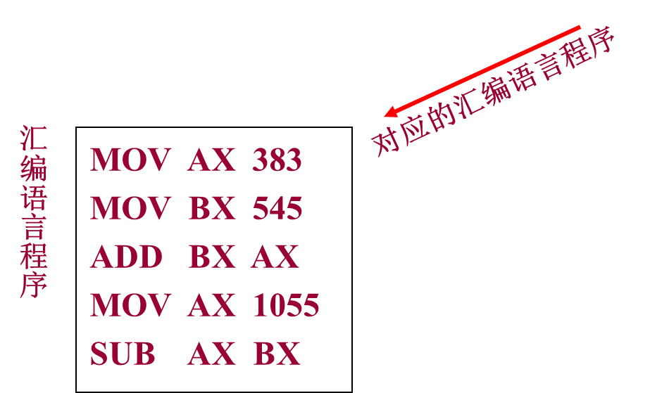
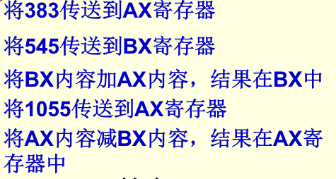

# 2.3程序设计语言

## 1.程序设计语言是什么

### 程序

程序是为了用计算机解决某个问题而采用程序设计语言编写的一个指令序列。

### 程序设计语言

语言的目的是用于通信
程序设计语言用于人与计算机之间的通信
程序设计语言是由人使用但计算机可以理解的一种语言
程序设计语言用于编制程序，表达需要计算机完成什么任务和怎样完成任务，然后交给计算机去完成

### 程序设计语言基本三要素

1. 语法
2. 语义
3. 语用

## 2.程序设计语言的分类

按级别可分为：机器语言、汇编语言、高级语言

### 1.机器语言

1. 机器语言就是计算机的指令系统（考点）。
2. 指令是使用二进制编码表示的。
3. 用机器语言编程序, 也就是直接使用二进制代码编写程序。
4. 优点：可以直接被计算机执行。
5. 缺点：
   1. 记不住、难理解、效率低、不易维护。
   2. 不同的机器语言程序，相互不兼容。

> 现在已不直接用机器语言编制程序！

### 2.汇编语言

用助记符号来表示机器指令中的操作符与操作数。如ADD表示加法，SUB表示减法，MOV表示传送数据。操作数为十进制数。

优点：

1. 操作数直接使用十进制
2. 程序相对容易理解。

缺点：

1. 不能直接被计算机执行
2. 需要汇编程序进行编译
3. 大型程序难以开发
4. 需要依赖具体计算机

### 3.高级语言

目的：克服汇编语言的缺陷，提高编程和维护的效率 。

特点：

1. 接近人们日常使用的自然语言（主要是英语）容易理解、记忆和使用。
2. 克服了汇编语言的缺陷，提高了编程和维护效率。
3. 可移植性好，对硬件不太依赖。
4. 对使用的符号、词汇、语法和语义等各种语言成分都有严格的规定。
5. 需要进行编译或解释才可运行。

## 3.程序设计语言的组成

### 1.数据成分

程序中所涉及的数据部分（变量、数组、结构体等，即数据名、数据类型、数据结构等）。

### 2.运算成分

程序中包含的运算部分，包括算术运算、逻辑运算、关系运算等。

### 3.控制成分

程序中控制结构（顺序结构、选择结构、循环结构）

### 4.传输成分

程序中数据的传输（数据交换[赋值语句]、拷贝、io操作、函数传参与返回）

## 4.程序的控制结构

1. 顺序结构

   最基本、最普通的结构形式，按照程序中的语句行的先后顺序逐条执行。

2. 选择结构

   单分支（if）、双分支（if-else）、多分支（if-else if-else/switch···case）。

3. 循环结构

   for循环、while循环、do...while循环（循环体至少被执行一次）。

## 5.程序设计语言处理

### 1.翻译程序

任何一种语言处理系统都有一个翻译程序，把一种语言的程序翻译成等价的另一种语言的程序。

被翻译的语言和程序被称为源语言和源程序，翻译生成的语言和程序分别称为目标语言与目标程序。

翻译程序可分为三类：

1. 汇编语言 -> 机器语言：汇编程序
2. 按源程序中语句的执行顺序逐行翻译并立即执行：解释程序
3. 从高级语言到汇编语言或机器语言的翻译程序：编译程序（属于系统软件）

### 2.解释程序

适用于调试程序、交互程序等。

#### 1.解释

解释器直接解释并立即执行源语言程序，不产生目标程序（相当于两种语言之间的口译）。

#### 2.解释程序

按源程序中语句的执行顺序逐行翻译并立即执行，不产生目标程序。

解释型语言：Python

#### 3.优点

可简单实现，且易于在解释过程中灵活方便的插入、修改和调试。

#### 4.缺点

执行效率很低。多次重复执行的语句，编译程序只需要翻译一次，而解释程序需要重复翻译。

### 3.编译程序

#### 1.编译

把源程序翻译成机器语言目标程序后再执行,相当于笔译。

#### 2.编译程序

从高级语言到汇编语言或机器语言的翻译程序：编译程序（属于系统软件）。编译产生目标程序，可被反复执行，运行效率高。

适用于翻译规模大、结构复杂、运行时间长的大型应用程序。

编译型语言：C、C++、C#、Java

#### 3.处理过程

编辑 -> 编译 -> 链接 -> 运行

## 6.常用程序设计语言

1. FORTRAN:面向过程，用于数值计算。

2. Java：跨平台，适用于网络，面向对象(单继承)。

   **Java即是编译型的，也是解释型语言，总的来说Java更接近解释型语言**。

   - 可以说它是编译型的。因为所有的Java代码都是要编译的，.java不经过编译就什么用都没有。同时围绕JVM的效率问题，会涉及一些如JIT、AOT等优化技术，例如JIT技术，会将热点代码编译成机器码。而AOT技术，是在运行前，通过工具直接将字节码转换为机器码。
   - 可以说它是解释型的。因为Java代码编译后不能直接运行，它是解释运行在JVM上的，所以它是解释运行的。

3. C：面向过程，多用于系统、底层软件等，Linux内核是C写的。

4. C++：面向对象（多继承）。

5. C#：面向对象（单继承）。

6. VB：面向对象；VBA：宏语言；Office:二次开发语言

7. BASIC：面向过程或结构化语言

8. 人工智能常用的语言：Prolog(逻辑式)、Lisp（函数式）、Python、Java、R

9. 脚本语言：VBA、JavaScript、VBScript、ActionScript、PHP
