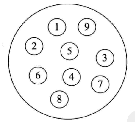
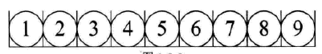

# 2.4算法与数据结构

## 1.算法的基本概念及其复杂度

### 算法

```
程序=算法+数据结构。（Niklaus Wirth 尼克劳斯·沃斯的《算法+数据结构=程序》）

算法是解决问题的方法与步骤。是指解决问题的一种方法或一个过程，即解决问题的有限运算序列。
```

### 算法的必要满足条件

1. 确定性。算法中的每条指令必须有确切的定义，无二义性。
2. 有穷性。算法必须在有限的时间内做完，即算法必须在执行完有限个步骤之后停止。
3. 可行性。算法中的描述在计算机中能执行，且在有限时间内完成。
4. 输出。至少有一个输出，但是可以没有输入。

```
1.算法的组成要素：算法由数据对象的运算和操作以及控制结构组成。
2.算法的基本运算操作：算数运算、逻辑运算、关系运算、数据传输。
3.算法的基本的控制结构：顺序结构、选择结构、循环结构。
```

> 关于算法，需要考虑三个方面的问题：<font color=red>算法设计</font>、<font color=red>算法表示</font>、<font color=red>算法分析</font>

#### 算法设计

算法的基本设计方法：列举法、归纳法、递归、递推、减半递推。

#### 算法表示

1. 自然语言
2. 流程图
3. 伪代码（PDL）
4. 程序设计语言

#### 算法分析

是对算法的优劣进行评价。是指对算法的运行时间和占用空间做定量分析。分析的目的是<font color=red>降低算法的时间复杂度和空间复杂度</font>，提高算法的执行效率。

算法分析的内容:

1. 正确性。算法的正确性是评价一个算法优劣的最重要的标准。
2. 复杂度：**算法效率的质量**。时间复杂度和空间复杂度。
3. 可读性。
4. 健壮性。

##### 时间复杂度

时间复杂度是指执行算法所需要的**计算工作量**。通常一个算法执行所用的时间包括编译时间和运行时间。时间复杂度是一个函数，定性表述该算法的运行时间。时间复杂度是指<font color=red>执行算法所需要的基本运算次数</font>。

> 算法计算工作量的度量，不仅应该与所用的计算机、采用的程序设计语言以及程序的编写者无关，而且应该与算法实现过程中的许多细节无关。算法执行的基本运算次数与问题的规模<font color=red>有关</font>。对于一个固定的规模，算法执行的基本运算次数可能与特定的输入有关。

常见的时间复杂度表：

| 执行次数函数                       | 阶               | 非正式术语 |
| ---------------------------------- | ---------------- | ---------- |
| 12                                 | O(1)             | 常数阶     |
| 2n+3                               | O(n)             | 线性阶     |
| 3n<sup>2</sup>+2n+1                | O(n<sup>2</sup>) | 平方阶     |
| 5log<sub>2</sub>n+20               | O(logn)          | 对数阶     |
| 2n+3nlog<sub>2</sub>n+19           | O(nlogn)         | nlogn阶    |
| 6n<sup>3</sup>+2n<sup>2</sup>+2n+4 | O(n<sup>3</sup>) | 立方阶     |
| 2<sup>n</sup>                      | O(2<sup>n</sup>) | 指数阶     |

常用的 时间复杂度所耗费的时间从小到大依次是：


##### 空间复杂度

空间复杂度是指执行算法所需要的内存空间。包括算法程序所占的空间，输入的初始数据所占的空间，算法执行过程中所需的额外空间。

空间复杂度与时间复杂度并不相关。

##### 最坏比较次数

1. 顺序查找

   只能用顺序查找的情况：线性无序表，有序线性列表。

   长度为n的线性表最坏查找次数：n次。时间复杂度为O(n)

   最大值或最小值的比较次数为n-1次。

2. 二分法查找

   二分法只适用于<font color=red>顺序存储的有序表</font>。最坏比较次数：log<sub>2</sub>n次。


##### 算法小结


## 2.数据结构

### 定义

**数据结构**是相互之间存在一种或多种特定关系的**数据元素**的集合。

在计算机中，数据元素并不是孤立、杂乱无序的，而是具有内在联系的数据集合。数据元素之间存在的**一种或多种特定关系**，也就是数据的组织形式。


数据：

**数据**是描述客观事物的符号，是计算机中可以操作的对象，是能被计算机识别，并输入给计算机处理的符号集合。它可以包括整型、实型等数值类型，也可以包括字符及声音、图像、视频等非数值类型。

数据其实就是符号，而且这些符号必须具备两个前提：

- 可以输入到计算机中
- 能被计算机程序处理


<font color=red>数据元素</font>

**数据元素**是组成数据的、具有一定意义的基本单位，在计算机中通常作为整体处理。也被称为记录。

例：人类中的数据元素是人；电影中的数据元素有角色、演员等。


数据项

一个数据元素可以由若干个数据项组成。比如人的眼睛、鼻子、耳朵。数据项是数据不可分割的最小单位。


数据对象

**数据对象**是性质相同的数据元素的集合，是数据的子集。性质相同是指：数据元素具有相同数量和类型的数据项。

在实际应用中，处理的数据元素通常具有相同性质，在不产生混淆的情况下，我们都将数据对象简称为数据。


### 数据结构的划分

按照视点不同，数据结构分为逻辑结构和物理结构。

研究数据结构一般包括三个方面：数据的逻辑结构、数据的物力结构和定在裸机结构和存储结构上的运算。数据结构是研究非数值计算的程序设计问题中计算机的操作对象及他们之间的关系和操作的一门课程。

#### 1.逻辑结构

**逻辑结构**是指数据对象中的元素之间的相互关系。逻辑结构又分为以下四种：

1. 集合结构

   **集合结构中的数据元素除了同属于一个集合外，他们之间没有其他关系**。各个元素之间是相互平等的，他们的共同属性是“同属与一个集合”。

   

2. 线性结构

   线性结构中的数据元素之间是**一对一**的关系。

   

3. 树形结构

   树形结构中的数据元素之间存在**一对多**的层次关系。

   

4. 图形结构

   图形结构的数据元素是**多对多**关系。

   

#### 2.物理结构

物理结构也可以叫做存储结构，是指数据的逻辑结构在计算机中的存储形式，包括数据元素的存储方式和关系的存储方式。物理结构实际上就是如何把数据元素存储到计算机的存储器中（主要是针对内存而言，外部存储器的数据组织通常用文件结构来描述）。

数据元素的存储结构形式有两种：顺序存储和链式存储。

1. 顺序存储

   顺序存储结构是把数据元素存放在地址连续的存储单元内，其数据见的逻辑关系和物理关系是一致的。

   

这种存储结构就是排队占位。每个元素按顺序排好。数组就是这种存储结构。当你告诉计算机你要建立一个有9个整型数据的数组时，计算机就在内存中找了片空地，按照一个整型所占的位置的大小乘以9，开辟一段连续的空间，数据依次排放。

> 顺序结构主要应用于线性的数据结构，顺序结构只存储结点的数据，不存储结点之间相互关系信息。一般称为紧凑存储结构。

2. 链式存储

   链式存储结构是把数据元素存放在任意的存储单元内，这组存储单元可以是连续的也可以是不连续的。数据元素的存储关系不能反映其逻辑关系，因此需要用一个指针存放数据元素的地址，这样通过地址就可以找到相关联数据元素的位置。

   

> 链式存储结构适用于线性结构和非线性结构。适合表示因经常进行插入、删除等操作而频繁发生动态变化的数据结构。

### 数据结构的图形表示

1. 数据元素用方框表示
2. R关系的二元组： 一条有向线段从前件指向后件。（带箭头）
   1. 没有前件（前继）的结点称为“根结点”
   2. 没有后件（后继）的结点称为“叶子结点”
   3. 除了根节点和叶子结点的其他结点称为“内部结点”


## 3.线性结构与非线性结构

### 1.线性结构

堆、栈、双向链表等

特点：

1.  有且只有一个根结点
2. 每个结点最多有一个前件，也最多有一个后件

向量、二维表、矩阵、循环队列与循环链表均为线性结构。线性结构一定能采用顺序存储结构。

### 2.非线性结构

不满足线性结构条件的数据结构。

二叉树、二叉链表、树形结构属于非线性结构。

具有两个根结点的数据结构一定是非线性结构；没有根结点或叶子结点的数据结构一定是非线性结构。有且只有一个根节点的数据结构可能是线性结构（队列、链表），也可能是非线性结构（二叉树）

## 4.线性表


### 1.线性表的定义

线性表是具有相同数据类型的n(n≥0)个数据元素的有限序列。其中n为表长，当n=0时该线性表是一个空表。若用L命名线性表，则其一般表示如下：

L=(a1,a2,...ai,ai+1,...,an)

其中，a1是唯一的“第一个”数据元素，又称为**表头**元素；an是唯一的“最后一个”数据元素，又称为**表尾**元素。除第一个元素外，每个元素有且仅有一个直接前驱；除最后一个元素外，每个元素有且仅有一个直接后继。

### 2.线性表的特点

- 表中元素的个数有限
- 表示数据元素之间的一对一关系
- 表中元素具有逻辑上的顺序性，在序列中各元素排列有先后次序；
- 表中元素都是数据元素，每一个表元素都是单个元素；
- 表中元素的数据类型都相同，这意味着每一个表元素占有相同数量的存储空间；
- 表中元素具有抽象性，就是说，仅讨论表元素之间的逻辑关系，不考虑元素究竟表示什么内容。

### 3.线性表的分类


### 4.线性表的基本操作

```java
InitList(L)         //初始化表。构造一个空的线性表；
Legnth(L)           //求表长度。返回线性表L的长度，即L中数据元素的个数；
LocateElem(L,e)     //按值查找操作。在表L中查找具有给定关键字值的元素；
GetElem(L,i)        //按位查找操作。获取表L中第i个位置的元素的值；
ListInsert(L,i,e)   //插入操作。在表L中第i个位置上插入制定元素；
ListDelete(L,i,e)   //删除操作。删除表L中第i个位置上的元素；
PrintList(L)        //输出操作。按前后顺序输出线性表L的所有元素的值；
Empty(L)            //判空操作
```

### 5.线性表的顺序存储结构

线性表的顺序存储有称之为**顺序表**。它是用一组**地址连续**的存储单元，**依次**存储线性表的数据元素，从而使得逻辑上相邻的两个元素在物理上也**相邻**。第一个元素存储在线性表的起始位置，第i个元素的存储位置后面紧接着存储的时第i+1个元素。
因此，顺序表的特点是表中元素的**逻辑顺序与物理顺序相同。**

一维数组可以是静态分配的，也可以是动态分配的。
在静态分配时，由于数组的大小和空间事先已经确定，一旦空间占满，再加入新的数据将会产生溢出，导致程序崩溃。比如上述描述便是采用静态分配。
当采用动态分配时，存储数组的空间是在程序执行过程中通过动态存储分配语句分配的，一旦数据空间占满，可以另外开辟一块更大的存储空间，用以替换原来的空间，从而达到扩充数组空间的目的，因此不需要一次性划分所有的所需空间给线性表.

> 动态分配并不是链式存储，同样属于顺序存储结构，其物理结构并没有发生变化，依然是随机存取方式，只是在分配存储空间时可以在运行决定。

因为顺序表采用的时顺序存储，因此具有顺序存储的几个重要特点：

- 具有随机访问特性，即通过首地址和元素序号可以在O(1)的时间内找到指定元素；
- 存储密度高，每个节点只存储数据元素；
- 逻辑上相邻的元素物理上同样相邻，所以插入和删除操作需要移动大量元素。

### 6.顺序表的插入与删除操作

#### 6.1 插入

在顺序表L的第i(1≤i≤L.length+1)个位置插入新元素e，如果i的输入不合法，则返回-1，表示插入失败；否则，将顺序表的第i个元素以及其后的元素右移一个位置，腾出一个空位置插入新元素e，顺序表长度加1，插入成功，返回0；


插入操作的算法分析：

最佳情况：在表尾直接插入（即i=n+1），无需移动任何元素，则时间复杂度为O(1)；
最坏情况：在表头插入即（即i=1），每个元素后移一位，即移位语句执行n次，时间复杂度为O(n)；
平均情况：假设pi(pi=1(n+1))是在第i个位置上插入一个节点的概率，则在长度为n的线性表中插入一个节点时所需移动节点的平均次数为

∑i=1n+1pi(n−i+1)=∑i=1n+11n+1(n−i+1)=1n+1∑i=1n+1(n−i+1)=1n+1n(n+1)2=n2

因此，线性插入算法的平均时间复杂度为O(n)。

#### 6.2 删除

删除顺序表L中第i(1≤i≤L.length)个位置的元素，成功返回0，否则返回-1，并将被删除的元素采用指针调用的方式返回。


删除操作的算法分析：

最佳情况：删除表尾元素（即i=n），无需移动任何元素，则时间复杂度为O(1)；
最坏情况：删除表头元素（即i=1），需要移动除第一个元素外的所有元素，即移位语句执行n次，时间复杂度为O(n)；
平均情况：假设pi(pi=1n)是删除第i个位置上节点的概率，则在长度为n的线性表中删除一个节点时所需移动节点的平均次数为

∑i=1npi(n−i)=∑i=1n1n(n−i)=1n∑i=1n(n−i)=1nn(n−1)2=n−12

因此，线性删除算法的平均时间复杂度为O(n)。

## 5.栈和队列


栈和队列属于受限线性表。受限线性表最简单直白的理解便是插入，删除，查找等操作时，不能随心所欲的进行，必须遵循一定的限制（规则）。

### 5.1 栈

#### 1.定义

栈（stack）是一种只允许在一端进行插入或删除操作的线性表。
一般规定，栈只能在**栈顶**进行插入，删除操作。因此访问元素的顺序是**先进后出**。

如图所示：


> - 栈顶（top）：栈的操作中，仅允许插入和删除的那一端。
> - 栈底（bottom）：固定的，不允许进行插入和删除操作的那一端。
> - 空栈：不含有任何元素的空线性表。


#### 2.栈的基本操作

> ```
> InitStack(&S)   //初始化一个空栈S
> StackEmpty(S)   //判断一个栈是否为空
> Push(&S,x)      //入栈，若栈未满，则将x加入使之称为新栈顶
> Pop(&S,x)       //出栈，若栈非空，则弹出栈顶元素，并用x返回
> GetTop(S,&x)    //读取栈顶元素，若栈S非空，则用x返回栈顶元素
> ClearStack(S)   //销毁栈，并释放栈S占用的存储空间
> ```


#### 3.顺序栈

栈作为一种受限的线性表，同样可以划分为顺序结构存储的栈（这里简称**顺序栈**）和链式结构存储的栈（这里简称**链栈**）。

##### 1.定义

栈的顺序存储称为顺序栈，是利用一组地址连续的存储单元存放从栈底到栈顶的元素，同时附设一个指针（top）指示当前栈顶的位置。如图所示：


这里对顺序栈的判断条件进行说明。

> - 栈空条件：top==-1
> - 栈满条件：top==MaxSize-1
> - 栈长：top+1

##### 2.顺序栈的基本操作

###### 1.初始化操作

完成对栈顶指针的复位操作。

```c
void InitStack(SqStack* s)
{
    s->top=-1;
}
```

###### 2.判空操作

如果栈为空，则返回0；如果栈不为空，则返回-1。

```C
int StackEmpty(SqStack* s)
{
    if(s->top==-1){
        return 0;
    }else{
        return -1;
    }
}
```

###### 3.入栈操作

首先判断栈是否已满，如果栈已经满了，则返回-1；如若没有满，则在栈顶中插入元素，并返回0，栈顶指针进一（top+1）。

```C
int Push(SqStack* s, ElemType x)
{
    if(s->top==MaxSize-1){
        return -1;
    }
    s->data[++s->top]=x;
    return 0;
}
```

###### 4.出栈操作

首先判断栈是否为空，如果已经为空，则返回-1；如果不为空，则取得栈顶元素，并返回0，栈顶指针退一（top-1）。

```C
int Pop(SqStack* s, ElemType* x)
{
    if(s->top==-1){
        return -1;
    }
    *x=s->data[s->top--];
    return 0;
}
```

###### 5.读栈顶元素

首先判断栈是否为空，如果为空，则返回-1；如果不为空，则返回栈顶元素，并返回0。

```C
int GetTop(SqStack* s, ElemType *x)
{
    if(s->top==-1){
        return -1;
    }
    *x=s->data[s->top];
    return 0;
}
```

### 5.2 队列

#### 1.定义

队列（Queue）简称队，只允许在线性表的一端进行插入，另一端进行删除。

一般规定，只能在**队尾**进行**插入**操作，**队头**进行**删除**操作。因此访问时的顺序是**先进先出**。

如下图所示：


几个重要的概念

- 队头：允许删除的一端，又称为队首。
- 队尾：允许插入的一端。
- 空队列：不含任何元素的空表。

#### 2.队列的基本操作

> ```
> InitQueue(&Q)   //初始化队列，构造一个空队列
> QueueEmpty(&Q)  //判断队列是否为空
> EnQueue(&Q,x)   //入队，若队列Q未满，将x加入，使之称为新的队尾
> DeQueue(&Q,&x)  //出队，若队列Q非空，删除队头元素，并用x返回
> GetHead(Q,&x)   //读取队头元素，若队列非空，则将队头元素赋值给x
> ```

#### 3.顺序队列

与栈类似，同样有使用顺序结构存储的队列（这里简称顺序队列）和链式结构存储的队列（ 这里简称链队列）。

##### 1.定义

队列的顺序实现是指分配一块**连续**的存储单元用于存放队列中的元素，并附设两个指针**front**和**rear**分别指示**头元素**和**队尾元素**。设队头指针指向队头元素的位置，队尾指针指向队尾元素的下一个位置。

顺序队列的判断条件进行说明：

> - 队空条件：Q.front==Q.rear==0
> - 队满条件：> Q.rear==MaxSize

这里应当注意到，上述判断队满条件实际是不正确的，比如当front指向队尾元素，而rear的值刚好等于MaxSize。
此时从data[0]到data[MaxSize−2]的所有元素中，均没有存储任何元素，但是根据上述判断条件却“已满”，造成“假溢出”。
为了解决这个问题，常见的有两种解决方法。

> 1. 将队列元素向前“平移”重新占用0至rear-front-1的空间
> 2. 将队列看成首尾相连的循环队列

因为平移会浪费大量的无用时间，因此一般使用**循环队列**解决判断是否队满的问题。

**循环队列**将一个顺序队列“臆造”成一个环状的空间，即把存储队列元素的表从逻辑上看成一个环，物理上依旧使用**顺序存储**结构。
在引入循环队列的同时，也引入判断队列是否为空或满的三种常见方法。

**1). 牺牲一个单元来区分队空和队满**

- 队空条件：Q.front==Q.rear
- 队满条件：(Q.rear+1)%MaxSize==Q.front
- 队列中元素的个数：(Q.rear-Q.front+MaxSize)%MaxSize

**2). 增设表示元素个数的数据成员size**

- 队空条件：Q.size==0
- 队满条件：Q.size=MaxSize
- 队列中元素的个数：Q.size

**3). 增设数据成员标志tag**

- 队空条件：Q.tag==0&&Q.front==Q.rear
- 队满条件：Q.tag==1&&Q.front==Q.rear

##### 2.循环队列的基本操作

###### 1.初始化操作

完成对队首指针和队尾指针的复位操作。

```C
void InitQueue(SqQueue* Q)
{
    Q->front=0;
    Q->rear=0;
}
```

###### 2.入队操作

首先判断队列是否满。当循环队列非空且队尾指针等于排头指针，说明循环队列已满，不能进行入队运算，称为上溢。

因为队列中规定队尾指针指向队尾元素的下一个位置，因此在入队后需对队尾指针**自增1**。

```C
int EnQueue(SqQueue* Q, ElemType x)
{
    if((Q->rear+1)%MaxSize==Q->front){
        return -1;
    }
    Q->data[Q->rear]=x;
    Q->rear=(Q->rear+1)%MaxSize;
    return 0;
}
```

###### 3.出队操作

如果队空则返回-1；否则返回数据元素，并将排头指针进一。

```C
int DeQueue(SqQueue* Q, ElemType* x)
{
    if(Q->rear==Q->front){
        return -1;
    }
    *x=Q->data[Q->front];
    Q->front=(Q->front+1)%MaxSize;
    return 0;   
}
```

###### 4.判断队列是否为空

若为空则返回0；否则返回-1。

```C
int QueueEmpty(SqQueue* Q)
{
    if(Q->rear==Q->front){
        return 0;
    }else{
        return  -1;
    }
}
```

##### 3.队列的应用

打印机任务列表使用队列；诸如线程池、数据库连接池之类的池资源都会使用到队列。

> 1、在循环队列中，对头指针和队尾指针的动态变化决定队列的长度。
>
> 2、栈用栈顶指针表示栈顶，栈的插入和删除操作均在栈顶进行。队列用队头和队尾指针分别表示允许插入和删除的一端。
>
> 3、对于顺序存储和链式存储的栈和队列，进行插入和删除运算的时间复杂度均为O(1)。

## 6.线性链表

由于顺序表的插入，删除操作需要移动大量的元素，影响了运算效率，由此线性表的**链式存储**便应运而生。链式存储线性表时，逻辑上连续的元素物理结构上不需要连续，它们彼此可以通过“链”建立起数据元素之间的逻辑关系，因此对于线性表的插入，删除操作并**不需要**移动元素，只需**修改指针**即可。

### 6.1、线性单链表

#### 1、定义

线性表的链式存储又称为单链表，它是通过一组**任意的存储单元**来存储线性表中的数据元素。为了建立起数据元素之间的线性关系，对每个链表结点，除了存放**元素自身的信息**外，还需要存放一个指向其后继的**指针**。
单链表结点的结构如下图所示，其中，**data**为数据域，存放数据元素；**next**为指针域，存放其后继结点的地址。


```C
typedef struct LNode{
    ElemType data;
    struct LNode *next;
}LNode, *LinkList;
```

利用单链表在解决顺序表需要大量的连续存储空间的缺点的同时，也引入了一些不可避免的缺点。比如因为需要**额外的指针域**，因此需要额外的存储空间；由于单链表是离散的分布在存储空间中，所以单链表**不能**完成**随机**存取的操作。

为了方便标识一个单链表，我们一般需要引入**头指针**来操作整个单链表。此外，为了统一增加和删除元素的操作，我们一般会在单链表的第一个结点之前附加一个结点，称为**头结点**。头结点的指针域指向单链表的第一个元素结点。

> 这里应该注意区分头指针和头结点。而不管单链表有没有头结点，头指针总是指向单链表的第一个结点。简单说就是如果单链表有头结点，那么头指针将指向头结点；如果单链表没有头结点，头指针将指向单链表的第一个结点。此处我们应该注意到一般情况下**头结点内不存储任何信息**。这里说明下，如果后面的例题中没有具体说明，**一般都是建立有头结点的单链表**。


引入头节点后，可以带来两个优点：

- 由于开始节点的位置被存放在头节点的指针域中，所以在链表的第一个位置上操作与表其他位置上的操作一致，无需进行特殊处理。
- 无论链表是否为空，其头指针都是指向头节点的非空指针（在空表中，头节点的指针域为空），因此也使得空表和非空表的处理方式变得统一。

#### 2、单链表的基本操作

##### 1、建立单链表

1. 头插法

   该方法中，首先建立一个具有头结点的空单链表，然后每生成一个读取到数据的新节点，就将其放置到头结点之后。如下图所示：

   

> 采用头插法建立单链表，读入数据的顺序与生成的链表中的元素的顺序刚好是相反的。
>
> 每个结点插入的时间复杂度为O(1)，设单链表长为n，则总的时间复杂度为O(n)。

2. 尾插法

   该方法中同样首先建立一个具有头结点的空单链表，然后每生成一个读取到数据的新节点，就将它插入到表尾；为了达到这样的目的，必须增加一个尾指针r，使其始终指向当前链表的尾结点。如下图所示

   

> 因为附加设置了一个指向表尾的尾指针r，因此每个结点插入的时间复杂度同样为O(1)，设单链表长为n，则总的时间复杂度为O(n)。

##### 2、插入结点

1. 插入后继结点

   插入操作是将值为x的新结点插入倒单链表的第i个位置上。先检查插入位置的合法性，然后找到待插入位置的前驱结点，即第i−1个结点，再在其后插入新的结点。

   算法首先需要调用`GetElem(L,i-1)`查找第i−1个结点。假设返回的第i−1个结点为*p，然后令新结点*s的指针域指向*p的后继结点，再令结点*p的指针域插入新的结点*s。其操作过程如下图所示：

   

算法中，时间的主要开销是查找第i−1个元素，时间复杂度为O(n)。若是在给定的结点后面插入新结点，则时间复杂度仅为O(1)。

2. 插入前驱结点

   在方法一中，我们可以在指针p指向的结点后面插入新的结点s，但是有时如果我们需要在指针p指向的结点前面插入新的结点s时，上述算法明显是办不到的。
   但是如果我们换个思路，将指针p指向的结点和s结点它们之间的数据域做一次交换，依旧将s结点插入到指针p指向的结点后面，如此我们便将前插操作变为了向指针p指向的结点的后插操作，并且在逻辑上仍旧满足条件。

   > 同方法一相同，时间的主要开销是查找第i−1个元素，时间复杂度为O(n)。若是在给定的结点后面插入新结点，则时间复杂度仅为O(1)。

##### 3、删除结点

1. 删除后继结点

   删除结点操作即将单链表的第i个结点删除。先检查删除位置的合法性，然后查找表中第i−1个结点（即将要被删除结点的前驱结点），然后在删除第i个结点。其操作过程如下图所示：

   

   假设我们要删除指针q指向的结点，那么我们首先通过遍历所有结点找到指针q指向的结点的前驱结点p，为了实现算法，我们只需修改指针p的指针域，将指针p的指针域next直接指向指针q指向的结点的指针域next所指的下一个结点便可。

   > 删除操作中，时间的主要开销是查找第i−1个元素，因此时间复杂度为O(n)。若是删除给定结点的后继结点，则时间复杂度为O(1)。

2. 删除自身结点

   删除指针所指向的自身结点（比如指针p指向的结点），此时如果继续使用上述方法明显是不可能的。我们采用与插入前驱结点相似的方法，将指针p所指向的结点的数据域与指针q所指向的结点的数据域进行一次交换（因为是一次删除操作，我们只需要将指针q指向的结点的数据域直接赋值为指针p指向的结点的数据域便可），这样，我们就又变成了删除指针q指向的结点的操作。

   > 与上述算法一样，删除操作中，时间的主要开销是查找第i个元素，因此时间复杂度为O(n)。若是删除给定的结点，则时间复杂度为O(1)。

##### 4、求链表长度

求表长实际上就是计算单链表中**数据结点（不含头节点）的个数**。为了达到这个目的，我们只需对链表进行一次遍历，同时设置计数器对每次访问到的结点计数便可。

> 遍历操作中需要访问所有结点，因此时间复杂度为O(n)。

### 6.2、双向链表

单链表中只有**一个**指向其后继结点的指针，使得单链表只能**从前向后**依次遍历，若要访问某个结点的前驱结点（或插入，删除操作时），只能从头开始遍历，访问后继结点的时间复杂度为O(1)，而访问前驱结点时，其时间复杂度为O(n)。
为了克服单链表的上述缺点，引入了**双链表**。

#### 1、定义

在双链表中引入了**两个指针**，分别为指向前驱结点的指针prior和指向后继结点的指针next。如下图所示：


```C
typedef struct DNode{
    ElemType data;
    struct DNode *prior, *next;
}DNode, *DLinkList;
```

双链表仅仅在单链表的基础上增加了一个指向前驱的prior指针，因此，在双链表执行按值查找和按位查找时的操作与单链表无异。但双链表在插入和删除操作的实现上与单链表相比有着较大的不同，因为在对“链”进行修改时不仅仅需要修改next指针域，此时还需要照顾到prior指针域，此时在操作时就必需保证在修改过程中不会断链。此外双链表可以很方便的找到其前驱结点，因此插入，删除结点时的时间复杂度仅为O(1)。

#### 2、双链表的基本操作

##### 1、建立双链表

1. 头插法建立双链表

   该方法中，首先建立一个具有头结点的空双链表，然后每生成一个读取到数据的新节点，就将其放置到头结点之后。如下图所示：

   

2. 尾插法建立双链表

   该方法中同样首先建立一个具有头结点的空双链表，然后每生成一个读取到数据的新节点，就将它插入到表尾；为了达到这样的目的，必须增加一个尾指针r，使其始终指向当前链表的尾结点。如下图所示：

   

##### 2、插入结点

1. 插入后继结点

   在双链表p所指的结点之后插入结点*s，其指针的变化过程一定不能乱，否则会断链，具体过程如下图所示：

   

2. 插入前驱结点

   在双链表p所指的结点之前插入结点*s，其指针的变化过程一定不能乱，否则会断链，具体过程如下图所示：

   

##### 3、删除结点

删除双链表中结点*p的后继结点*q，其指针的变化过程如下图所示：


### 6.3、循环链表

当使用单链表进行遍历的时候，我们只能从头结点开始，尾结点结束，如果需要查看指针所指向结点的前面结点，我们又必须从头结点开始遍历。为了解决这个问题，我们便引入了双链表，使其能够双向遍历，但是它又引入了prior指针域，增加了额外的开销。为此，我们便又引入了循环链表。所谓循环链表简单来说就是表尾的指针域指向表头从而使整个链表形成了一个闭环。

#### 1、循环单链表

循环单链表和单链表的的区别在于，表中最后一个节点的指针域不是NULL，而是指向了头结点，从而使整个链表形成一个环，如图所示：


在循环单链表中，表尾结点*r的next指针域指向头结点head，故表中没有指针域为NULL的结点。因此判断循环单链表是否为空的条件便是头结点的指针域是否指向自身。
循环单链表的插入，删除操作与单链表的基本操作一致，但是当在表尾结点处进行插入，删除操作时，必须注意不能使其断链。同时我们应注意到，一般情况下，我们对链表的操作大部分集中在表尾，如此，我们对循环单链表并不设置头指针，只设置一个尾指针，从而使得操作效率更高

#### 2、循环双链表

由循环单链表的定义我们很容易的便可以得到循环双链表，但与循环单链表不同的是循环双链表的尾结点的指针域next在指向头结点的同时， 头结点的prior指针域还必须指向尾结点。如图所示：


循环双链表中，链表为空的条件为头结点的prior指针域和next指针域均指向自身节点。

## 7.树

### 7.1 树的定义

**树(Tree)**：n(n >= 0)个结点构成的有限集合。

当n = 0时，称为空树;

对于任一棵非空树(n > 0)，它具备以下性质：

1. 树中有一个称为"根(Root)"的特殊结点，用r表示;
2. 其余结点可分为m(m>0)个互不相交的有限集T1，T2,....,Tm,其中每个集合本身又是一颗树，称为原来树的"子树(SubTree)"
3. 

**树与非树**

不是树的例子

1. 
2. 子树是不相交的;
3. 除了根结点外，每个结点有且只有一个父结点;
4. 一颗N个结点的树有N-1条边
5. **树是保证结点联通的最小的一种连接方式(边最少)**
6. 有一个m棵树的集合（也叫森林）共有k条边，问这m颗树共有多少个结点？k+m

### 7.2 树的一些基本术语

1. 结点的度(Degree)：结点的子树个数
2. 树的度：树的所有结点中最大的度数
3. 叶结点(Leaf):度为0的结点
4. 父结点(Parent)：有子树的结点是其子树的根节点的父节点
5. 子结点(Child)：若A结点是B结点的父节点，则称B结点是A结点的子结点;子节点也称孩子结点
6. 兄弟结点(Sibling)：具有同一父节点的各结点彼此是兄弟结点 
7. 

8. 祖先结点(Ancestor)：沿着树根到某一结点路径上的所有结点都是这个结点的祖先结点

9. 子孙结点(Descendant)：某一结点的子树中的所有结点是这个结点的子孙

10. 结点的层次(Lever)：规定根节点在1层，其他任一结点的层数是其父节点的层数加1

11. 树的深度(Depth)：树的所有结点中的最大层次是这颗树的深度


### 7.3 树的表示

数组实现：把这些结点按顺序存储在数组里面


链表表示：


这样树的结构：每个结点的结构的样子是不一样的。有的结点有3个指针，有的结点有1个指针，有的没有指针。这样整个这个结构的形式都不一样，会给后面的程序实现带来困难(因为访问之前没办法确认会带来多少个儿子)

### 7.4 二叉树

二叉树：

1. 度为2的树

2. 每个结点最多只有两颗子树，且左右之分不能互换。

   


#### 二叉树的五种基本形态

空二叉树、只有根节点的二叉树、只有左子树的二叉树、只有右子树的二叉树、左右子树均非空的二叉树


#### 特殊的二叉树

##### 斜二叉树(Skewed Binary Tree)

1. 只有左边或者只有右边，相当于一个链表
2. 

##### 完美二叉树(Perfect Binary Tree)

**或者叫做满二叉树(Full Binary Tree)**


特点：	一个深度为k(>=-1)且有2^(k) - 1个结点的二叉树称为完美二叉树。 满二叉树

##### 完全二叉树(Complete Binary Tree)

```
有n个结点的二叉树，对树种结点按从上到下，从左到右的顺序进行编号，编号为i(1 <= i <= n)结点与满二叉树中编号为i结点在二叉树中位置相同
跟上方的区别就是除了最底下一层可以右边缺一点，上面跟满二叉树是一样的。最底下一层左边顺序不能乱
```

#### 二叉树的性质

1. 在二叉树的第k层上最多有2<sup>k-1</sup>（k>=1）个结点。
2. 深度为m的二叉树最多有2<sup>m</sup>-1个结点（包括根结点）。
3. 在任意一课二叉树中，度为0的结点（叶子结点，n<sub>0</sub>）总是比度为2的结点（n<sub>2</sub>）多一个。n<sub>0</sub>=n<sub>2</sub>+1。
4. 具有n个结点的二叉树，其深度不小于[log<sub>2</sub>n]+1。（[log<sub>2</sub>n]表示log<sub>2</sub>n的整数部分）。


#### 二叉树与树的区别

1. 二叉树的结点的子树要区分左子树和右子树。即使在结点只有一棵子树的情况下也要明确指出子树是左子树还是右子树。
2. 二叉树的结点的最大的度为2，一般的树不限制结点数。
3. 二叉树、树、树林之间有一种自然的对应关系，他们之间可以互相转换。
4. 一棵树可以转换成唯一的二叉树，二叉树转换成树或树林也是唯一的。


#### 二叉树的存储结构

1. 顺序存储结构

   ```
   完全二叉树：按从上至下，从左到右顺序存储n个结点的完全二叉树的结点父子关系;
   //这个树最适合数组方式解决
   ```

   **一般二叉树**也可以采用这种结构，缺点：但会造成空间浪费....(将缺少的结点补上一个空结点)

   


2. 链表存储

   

```C
typedef struct TreeNode *BinTree;
typedef BinTree Position;
struct TreeNode{
    ElementType Data;
    BinTree Left;
    BinTree Right;
}
```


### 7.5 二叉树的遍历

#### 1、先序中序后序遍历

**(1)先序遍历**

根-左-右

```C
遍历过程为：
1.访问根节点
2.先序遍历其左子树
3.先序遍历其右子树 

对应的递归程序：
void PreOrderTraversal(BinTree BT)//BT是树
{
    if( BT ){//看树是不是空的，空的就退出去，不空就访问根节点
        printf("d",BT->Data);
        PreOrderTraversal(BT->Left);//指向左子树的那个根节点的地址进行递归
        PreOrderTraversal(BT->Right);//指向右子树的那个根节点的地址进行递归
    }
}
```


```
先是从根开始  A(B D F E)(C G H I)
先序遍历=>A B D F E C G H I
```

**(2)中序遍历**

左-根-右

```C
遍历过程为：
1.中序遍历其左子树
2.访问根结点;
3.中序遍历其右子树 
对应的递归程序：
void PreOrderTraversal(BinTree BT)//BT是树
{
    if( BT ){//看树是不是空的，空的就退出去，不空就访问根节点
        PreOrderTraversal(BT->Left);//指向左子树的那个根节点的地址进行递归
        printf("d",BT->Data);
        PreOrderTraversal(BT->Right);//指向右子树的那个根节点的地址进行递归
    }
}
```


```
中序遍历 => D B E F A G H C I
(D B E F) A ( G H C I)
先是左边再右边，这里我原本的疑问是为什么是先E在F而不是先F再E
原因是E-F是一个树，然后因为这个是左子树，所以从左边开始，E在F的左边
```


**(3)后序遍历**

左-右-根

```C
遍历过程为：
1.后序遍历其左子树
2.中序遍历其右子树 
3.访问根结点
对应的递归程序：
void PreOrderTraversal(BinTree BT)//BT是树
{
    if( BT ){//看树是不是空的，空的就退出去，不空就访问根节点
        PreOrderTraversal(BT->Left);//指向左子树的那个根节点的地址进行递归
        PreOrderTraversal(BT->Right);//指向右子树的那个根节点的地址进行递归
        printf("d",BT->Data);
    }
}
```


```
注意点：后序遍历，那当然得从下面开始咯，所以会发现B跟E是E优先。H跟C比是H优先
 (D E F B)(H G I C) A
 后序遍历 => D E F B H G I C A
```

**总结**

```
先序、中序和后序遍历过程：遍历过程中经过结点的路线一样，只是访问各结点的时机不同
图中先从入口到出口的曲线上用三种符号分别标记除先序，中序和后序的访问各结点时刻
```


